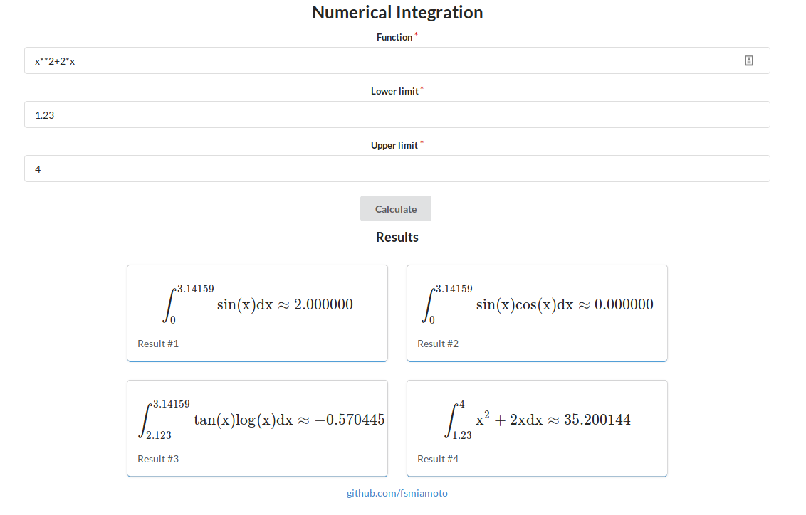

# integration-flask-react

An test app where you can make a numerical integration using Flask and React integrated (ha!)

### Requirements

-   Node
-   Python 3

### Setting up

```bash
# Clone the repo
git clone https://github.com/fsmiamoto/integration-flask-react.git

# Install Pythons libraries
cd integration-flask-react/api
# May require sudo or use the --user flag
pip install -r requirements.txt

# Install React app dependencies
cd ../frontend
npm install

```

### Running the App

To run the app, first open a terminal and then run the Python API

```bash
# At integration-flask-react directory...
python api/api.py
```

Now, at another terminal, you can run the React app and see it working!

```bash
# At integration-flask-react directory...
cd frontend && npm start
```


